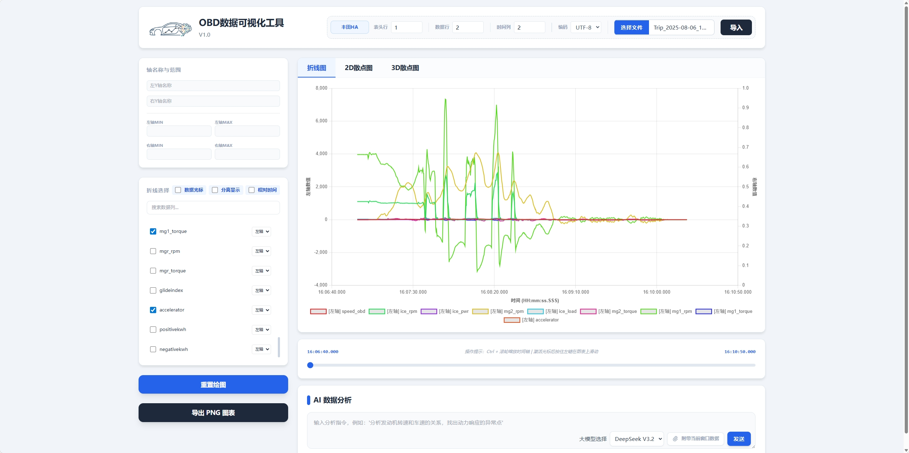
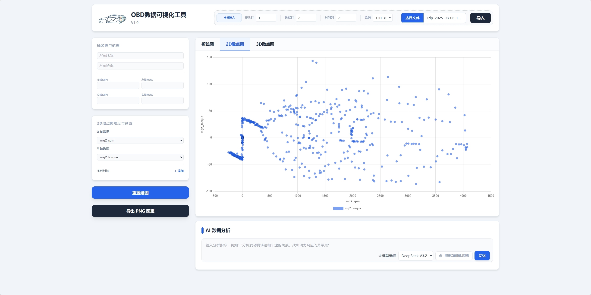
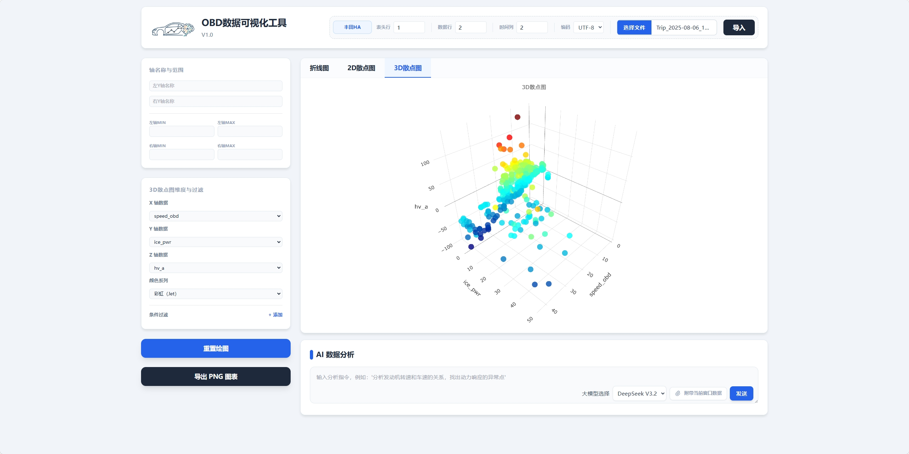
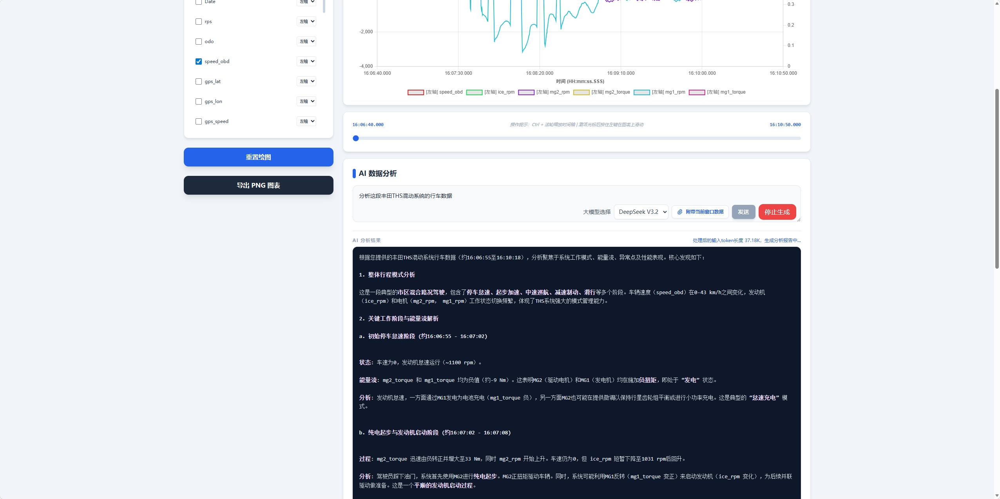

# 车辆OBD数据流可视化工具

## 声明：本软件由Vibe Coding开发
特别鸣谢：Github Copilot, CodeX, Cursor, Google Gemini 

## 截图
| 折线图                                                                              | 2D散点图                                                                              | 3D散点图                                                                              | AI辅助分析                                                                              |
| ----------------------------------------------------------------------------------- | ------------------------------------------------------------------------------------- | ------------------------------------------------------------------------------------- | --------------------------------------------------------------------------------------- |
|  |  |  |  |

## 功能
- [x] 读取OBD记录的csv终端数据流
- [x] 绘制折线图
- [x] 绘制2D散点图
- [x] 绘制3D散点图
- [x] 导出透明背景图片
- [x] 将图窗数据导入AI大模型辅助分析

## TODO
- [ ] AI辅助数据清洗

## 支持的数据格式
Car Scanner、Hybrid Assistant等OBD监控工具导出的带时间戳的csv格式文件

### 绝对时间戳解析

对于带绝对时间戳的数据，会将日期删去仅留下时间，支持的绝对时间戳数据格式如下：

| Time                    | Data 1 | Data 2 | Data n |
| ----------------------- | ------ | ------ | ------ |
| 2026-04-28 11:08:00.001 | 255    | 000    | xxx    |
| 2026-04-28 11:08:00.002 | 256    | 111    | xxx    |

### 相对时间戳解析

对于带相对时间戳的数据，会根据数据末尾的单位将时间转换成秒，无单位默认为秒，支持毫秒(ms)、秒(s)、分(m)、小时(h)四种时间单位，相对时间戳数据格式如下：

1. **表头带单位：**优先按表头的单位解析时间，支持下划线和半角括号两种格式

| Time (s) | Data 1 | Data 2 | Data n |
| -------- | ------ | ------ | ------ |
| 0.001    | 255    | 000    | xxx    |
| 0.002    | 256    | 111    | xxx    |

| Time_s | Data 1 | Data 2 | Data n |
| ------ | ------ | ------ | ------ |
| 0.001s | 255    | 000    | xxx    |
| 0.002s | 256    | 111    | xxx    |

2. 数字后带单位：按数字后单位解析时间，若表头同时带单位则优先按表头的单位解析

| Time   | Data 1 | Data 2 | Data n |
| ------ | ------ | ------ | ------ |
| 0.001s | 255    | 000    | xxx    |
| 0.002s | 256    | 111    | xxx    |

| Time | Data 1 | Data 2 | Data n |
| ---- | ------ | ------ | ------ |
| 1ms  | 255    | 000    | xxx    |
| 2ms  | 256    | 111    | xxx    |

2. 无单位：默认单位为秒

| Time  | Data 1 | Data 2 | Data n |
| ----- | ------ | ------ | ------ |
| 0.001 | 255    | 000    | xxx    |
| 0.002 | 256    | 111    | xxx    |

**PS：** 有些采集软件会将日期和时间分列排列（如Hybrid Assistant），注意选择正确的时间列

### 时间戳格式转换

通过勾选/取消勾选相对时间，可以将绘图时显示的时间格式在相对/绝对时间之间转换

## 软件架构
1. **前端：** 静态HTML网页，Nginx 驱动（**默认12315端口**）
2. **后端：** 大模型API，Node.js驱动 + Nginx 反向代理

## Docker部署
### 拉取仓库

```bash
git clone https://github.com/Stalker-404/OBD-Visualize-Tool.git
cd OBD-Visualize-Tool 
```
### 前端配置
1. **建立配置文件：** 建立`config.json`配置文件，格式参考`frontend/config.json.example`

```bash
cp frontend/config.json.example frontend/config.json
vim frontend/config.json
```

2. `config.json`配置文件全文参考如下

```JavaScript
{
    //配置AI分析中可供选择的大模型列表
    "LLMmodels": [
        {
            //模型名称，需与后端api.json保持一致
            "value": "deepseek-v3-2-251201",
            //显示在网页上的模型名称
            "label": "DeepSeek V3.2",
            //上下文长度限制
            "tokenLimit": 128000
        },
        {
            "value": "doubao-seed-2-0-lite-260215",
            "label": "豆包2.0 Lite",
            "tokenLimit": 128000
        }
    ],
    //配置网页显示的标题
    "Branding": {
        //浏览器标题
        "pageTitle": "OBD数据可视化工具",
        //网页Header主标题
        "appTitle": "OBD数据可视化工具",
        //网页Headr副标题
        "appSubtitle": "V1.0"
    },
    //配置文件模板，方便快速解析csv数据
    "FileTemplate": [
        {
            // 模板id
            "value": "carscanner",
            // 网页上显示的下拉选项名称
            "label": "CarScanner",
            // csv表头所在行
            "headerRow": 1,
            // csv有效数据起始行
            "dataRow": 2,
            // csv时间所在列
            "timeColumn": 1,
            // csv编码格式
            "headerEncode": "UTF-8"
        },
        {
            "value": "ha",
            "label": "Hybrid Assistant",
            "headerRow": 1,
            "dataRow": 2,
            "timeColumn": 2,
            "headerEncode": "UTF-8"
        }
    ],
    //网页访问密码，留空则跳过密码验证
    "password": "password"
}
```
1. **导入LOGO：** 将希望显示在网页Header左上角的PNG格式图片放入 `frontend/src/icon` 文件夹，命名logo.png,也可以使用默认的logo


```bash
cp frontend/src/icon/logo.png.example frontend/src/icon/logo.png
```

### 后端配置
1. **建立配置文件：** 建立`api.json`配置文件，格式参考`backend/api.json.example`

```bash
cp backend/api.json.example backend/api.json
vim backend/api.json
```

2. `api.json`配置文件全文参考如下

```JavaScript
{
    //大模型的model参数，与前端config.json中LLMmodels里的value保持一致
    "deepseek-v3-2-251201": {
        //API密钥
        "API_KEY": "YOUR_API_KEY_HERE",
        //API地址
        "API_URL": "https://ark.cn-beijing.volces.com/api/v3/chat/completions"
    },
    "doubao-seed-2-0-lite-260215": {
        "API_KEY": "YOUR_API_KEY_HERE",
        "API_URL": "https://ark.cn-beijing.volces.com/api/v3/chat/completions"
    }
}
```
### Docker运行

1. **读取权限：** 为确保前端能被Nginx正常驱动，请赋予frontend文件夹读写权限

```bash
chmod -R 755 frontend
```

2. **配置证书：** 如需HTTPS访问请自行配置`nginx\default.conf`，这里不再赘述

3. **通过compose运行容器**

```bash
docker compose up -d
```

4. **访问地址:** 网址+12315端口，如 [http://192.168.31.99:12315](http://192.168.31.99:12315)
